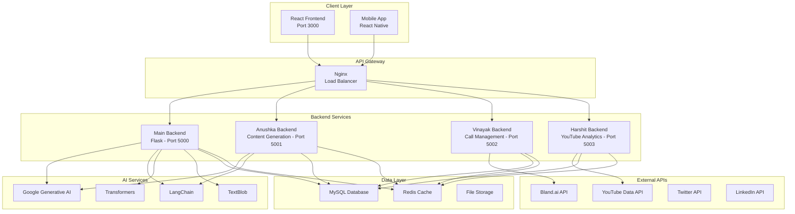
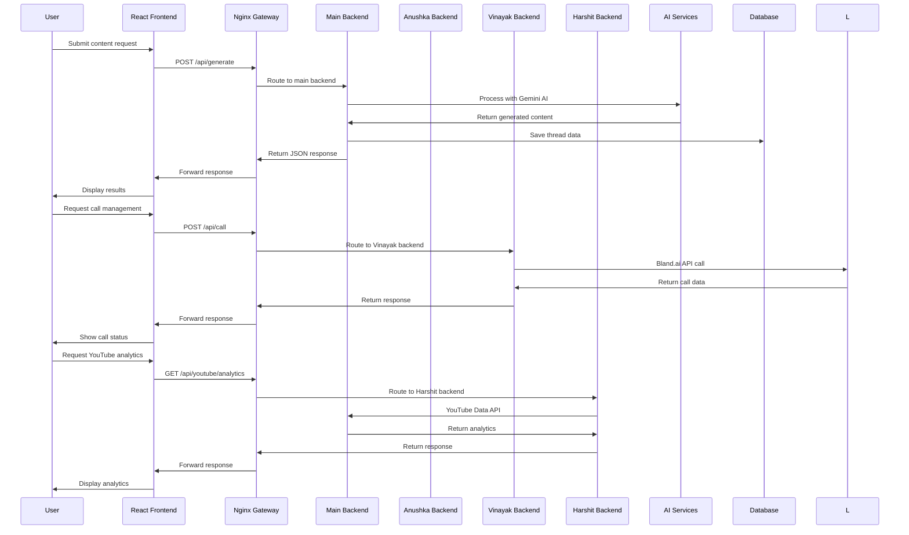
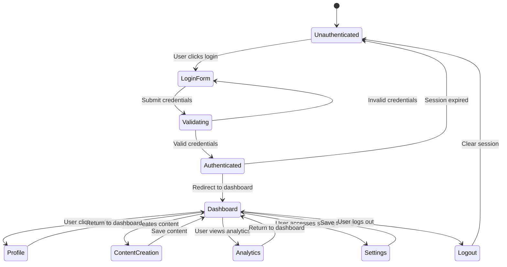
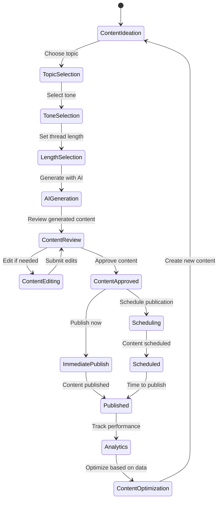
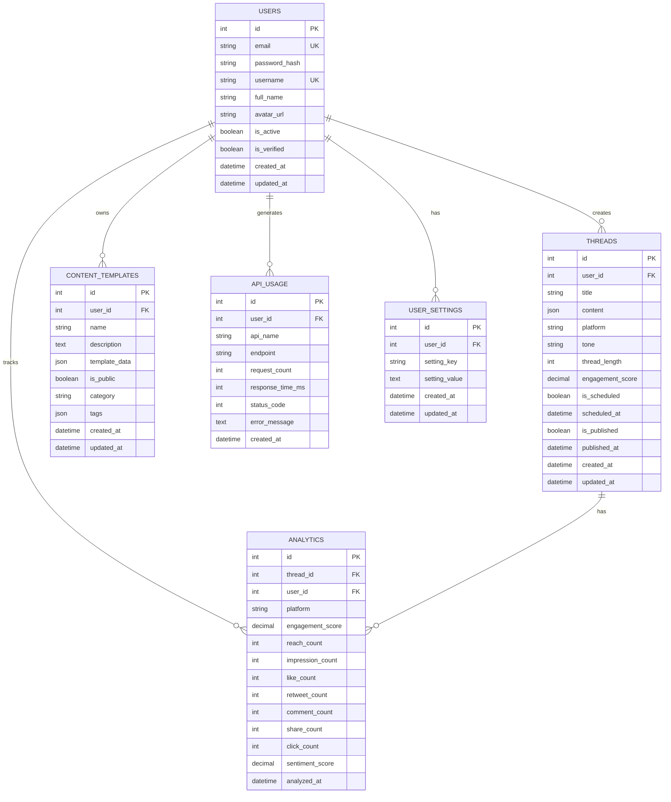
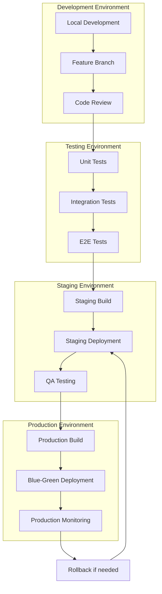
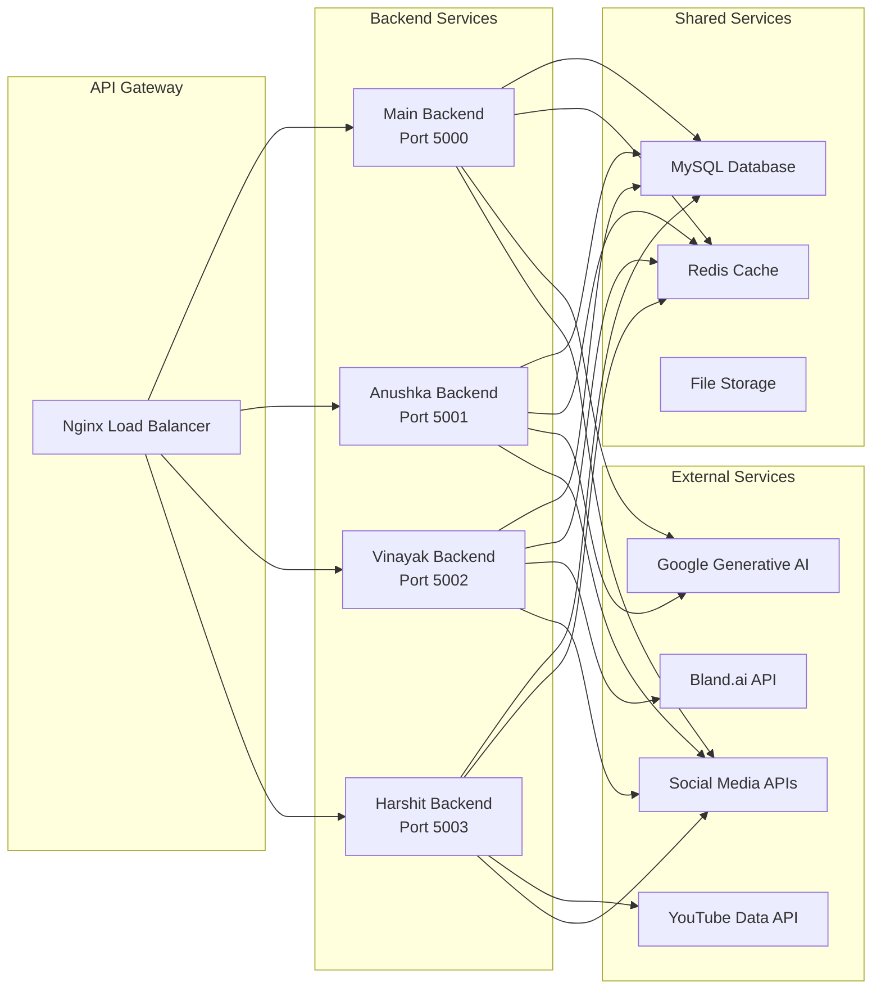
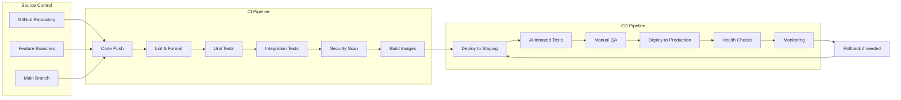

# Level Up - AI-Powered Social Media Content Platform

## 🎯 Project Overview

**Level Up** is a comprehensive AI-powered platform designed to solve the challenges of creating engaging, viral social media content through advanced technology. Our platform addresses the pain points of content creators, marketers, and social media managers by providing intelligent content generation, analytics, and optimization tools.

### 🎯 Problem Statement

Creating viral social media content is a complex challenge that requires:
- **Content Strategy**: Understanding what makes content go viral
- **Time Management**: Efficient content creation and scheduling
- **Analytics**: Measuring performance and optimizing based on data
- **Multi-Platform Management**: Coordinating content across different social networks
- **AI Integration**: Leveraging artificial intelligence for content generation and optimization

**Level Up** solves these challenges by providing an integrated platform that combines AI-powered content generation, advanced analytics, and intelligent workflow management.

## ✨ Features

### 🚀 Core Features
- **AI-Powered Content Generation**: Create viral threads using Google's Generative AI
- **Multi-Platform Support**: Twitter, LinkedIn, Instagram, and YouTube content
- **Real-time Analytics**: Track engagement, reach, and performance metrics
- **Smart Scheduling**: Intelligent content scheduling with optimal timing
- **PDF Export**: Export generated content as professional PDFs
- **Call Management**: Integrated voice call features using Bland.ai
- **YouTube Analytics**: Comprehensive YouTube channel analytics and insights

### 🎨 Advanced Features
- **Sentiment Analysis**: Analyze content tone and emotional impact
- **Viral Prediction**: Predict content virality potential
- **Content Templates**: Reusable templates for consistent branding
- **Collaborative Workflows**: Team-based content creation and approval
- **API Integration**: RESTful APIs for third-party integrations
- **Real-time Notifications**: Instant alerts for content performance

## 🛠️ Technology Stack

### 📁 Backend Technologies (by folder)

#### `server/` - Main Flask Backend
- **Flask** - Python web framework for API development
- **Google Generative AI** - Advanced content generation
- **LangChain** - AI/ML orchestration and prompt management
- **Transformers** - Natural language processing
- **TextBlob** - Sentiment analysis and text processing
- **FPDF** - PDF generation and export
- **Pillow** - Image processing and manipulation
- **Flask-CORS** - Cross-origin resource sharing

#### `anushka/` - Content Generation Service
- **Flask** - Dedicated content generation API
- **Google Generative AI** - Thread and content creation
- **LangChain** - AI prompt engineering
- **Transformers** - NLP processing for content optimization

#### `vinayak/` - Call Management Service
- **Flask** - Call management API
- **Bland.ai API** - Voice call integration
- **WebSocket** - Real-time communication
- **Audio Processing** - Call recording and analysis

#### `harshit/` - YouTube Analytics Service
- **Flask** - YouTube analytics API
- **Google OAuth** - YouTube API authentication
- **YouTube Data API** - Channel and video analytics
- **Pandas** - Data processing and analysis

#### `database/` - Data Layer
- **MySQL** - Primary database
- **Redis** - Caching and session management
- **SQLAlchemy** - ORM for database operations

### 📁 Frontend Technologies (`client/`)
- **React 19** - Modern UI framework
- **Vite** - Fast build tool and development server
- **Tailwind CSS** - Utility-first CSS framework
- **Framer Motion** - Smooth animations and transitions
- **React Router** - Client-side routing
- **Recharts** - Data visualization components
- **Leaflet** - Interactive maps integration
- **Lucide React** - Beautiful icon library
- **Axios** - HTTP client for API communication

### 📁 DevOps & Infrastructure
- **Docker** - Containerization for consistent deployment
- **Docker Compose** - Multi-service orchestration
- **Nginx** - Reverse proxy and load balancing
- **GitHub Actions** - CI/CD pipeline automation

## 🚀 Setup Instructions

### Method 1: Manual Setup (Bash Script)

#### Prerequisites
```bash
# Ensure you have the following installed:
# - Python 3.11+
# - Node.js 18+
# - Docker & Docker Compose
# - Git

# Clone the repository
git clone https://github.com/your-username/level-up.git
cd level-up
```

#### Backend Setup
```bash
# Create virtual environment
python -m venv venv
source venv/bin/activate  # On Windows: venv\Scripts\activate

# Install Python dependencies
pip install -r requirements.txt

# Set up environment variables
cp env.example .env
# Edit .env with your API keys

# Start main backend (Port 5000)
cd server
python app.py

# In new terminal - Start Anushka's backend (Port 5001)
cd anushka
python app.py

# In new terminal - Start Vinayak's backend (Port 5002)
cd vinayak
python app.py

# In new terminal - Start Harshit's backend (Port 5003)
cd harshit
python app.py
```

#### Frontend Setup
```bash
# Navigate to client directory
cd client

# Install Node.js dependencies
npm install

# Start development server
npm run dev
```

#### Database Setup
```bash
# Start MySQL database
docker run -d \
  --name levelup-mysql \
  -e MYSQL_ROOT_PASSWORD=password \
  -e MYSQL_DATABASE=levelup \
  -p 3306:3306 \
  mysql:8.0

# Initialize database schema
mysql -h localhost -P 3306 -u root -p levelup < database/init.sql
```

### Method 2: Docker Compose Setup

#### Quick Start
```bash
# Clone repository
git clone https://github.com/your-username/level-up.git
cd level-up

# Set up environment variables
cp env.example .env
# Edit .env with your API keys

# Build and start all services
docker-compose up --build -d

# View logs
docker-compose logs -f

# Stop services
docker-compose down
```

#### Service URLs
- **Frontend**: http://localhost:3000
- **Main Backend**: http://localhost:5000
- **Anushka Backend**: http://localhost:5001
- **Vinayak Backend**: http://localhost:5002
- **Harshit Backend**: http://localhost:5003
- **Database**: localhost:3306
- **Redis**: localhost:6379

#### Deployment Script
```bash
# Use the provided deployment script
./deploy-all.sh

# Deploy specific services
./deploy-all.sh deploy-backend anushka
./deploy-all.sh deploy-backend vinayak
./deploy-all.sh deploy-backend harshit

# Check service health
./deploy-all.sh health
```

## 📊 Mermaid Diagrams

### 1. System Architecture


### 2. API Flow (Frontend → Backend)


### 3. User Authentication State Machine


### 4. Content Creation Workflow State Machine


### 5. Database ER Diagram


### 6. Deployment Flow (Local/Dev/Prod)


### 7. Microservice Communication


### 8. CI/CD Pipeline Overview


## 🔧 Environment Configuration

### Required Environment Variables
```env
# Flask Configuration
FLASK_ENV=development
FLASK_DEBUG=1
FLASK_APP=app.py

# API Keys
GEMINI_API_KEY=your_gemini_api_key
COMPOSIO_API_KEY=your_composio_api_key
SERP_API_KEY=your_serp_api_key
EMAIL_PASSWORD=your_email_password
BLAND_API_KEY=your_bland_api_key

# Database Configuration
DATABASE_URL=mysql://user:password@db/levelup
REDIS_URL=redis://localhost:6379

# Frontend Configuration
REACT_APP_API_URL=http://localhost:5000
REACT_APP_ANUSHKA_API_URL=http://localhost:5001
REACT_APP_VINAYAK_API_URL=http://localhost:5002
REACT_APP_HARSHIT_API_URL=http://localhost:5003
```

## 📡 API Documentation

### Content Generation Endpoints
```bash
# Generate viral thread
POST /api/generate
{
  "topic": "AI in Healthcare",
  "tone": "professional",
  "thread_length": 5
}

# Analyze tweet metrics
POST /api/analyze
{
  "tweet_text": "Your tweet content",
  "platform": "twitter"
}

# Export thread as PDF
POST /api/export_pdf
{
  "thread_data": [...],
  "filename": "my_thread.pdf"
}
```

### Call Management Endpoints
```bash
# Initiate call
POST /api/call/initiate
{
  "phone_number": "+1234567890",
  "message": "Hello from Level Up"
}

# Get call status
GET /api/call/status/{call_id}
```

### YouTube Analytics Endpoints
```bash
# Get channel analytics
GET /api/youtube/analytics
{
  "channel_id": "your_channel_id",
  "date_range": "last_30_days"
}

# Get video performance
GET /api/youtube/video/{video_id}
```

## 🤝 Contributing

1. Fork the repository
2. Create a feature branch (`git checkout -b feature/amazing-feature`)
3. Commit your changes (`git commit -m 'Add amazing feature'`)
4. Push to the branch (`git push origin feature/amazing-feature`)
5. Open a Pull Request

### Development Guidelines
- Follow PEP 8 for Python code
- Use ESLint for JavaScript/React code
- Write tests for new features
- Update documentation for API changes
- Use conventional commit messages

## 📄 License

This project is licensed under the MIT License - see the [LICENSE](LICENSE) file for details.

## 🆘 Support

For support and questions:
- Create an issue in the GitHub repository
- Contact the development team
- Check the documentation wiki

---

**Built with ❤️ by the Level Up Team** 