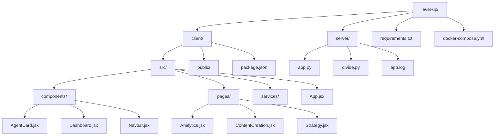
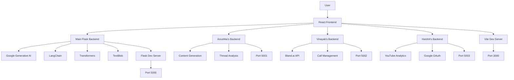
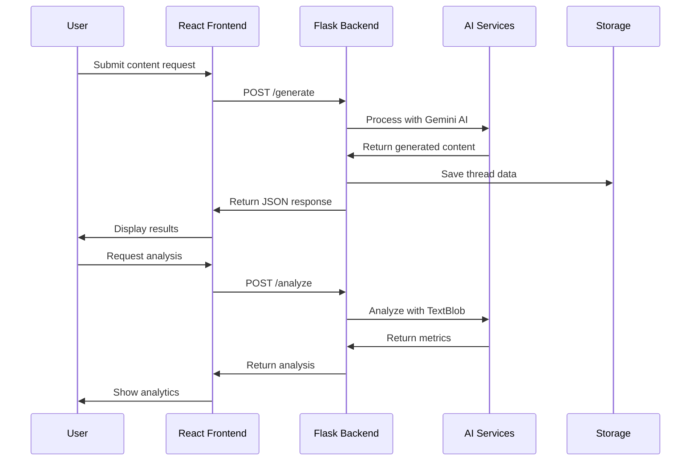
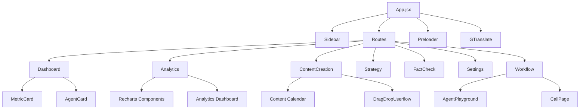
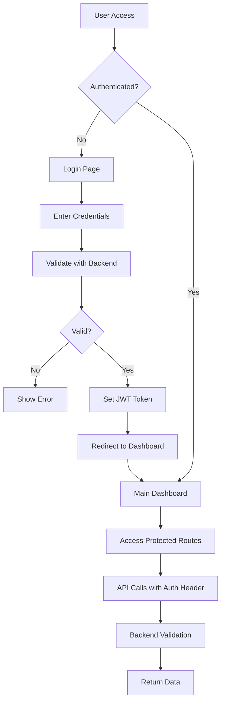
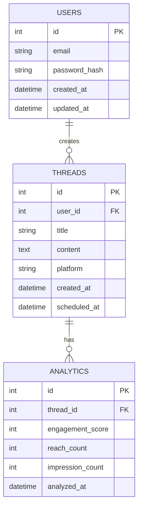

# Level Up - AI-Powered Social Media Content Platform

A fullstack web application that leverages AI to create, analyze, and optimize social media content. Built with Flask backend and React frontend, featuring advanced content generation, analytics, and workflow management.

## 🚀 Technology Stack

### Backend
- **Flask** - Python web framework
- **Google Generative AI** - Content generation
- **LangChain** - AI/ML orchestration
- **Transformers** - NLP processing
- **FPDF** - PDF generation
- **Pillow** - Image processing
- **TextBlob** - Sentiment analysis

### Frontend
- **React 19** - UI framework
- **Vite** - Build tool
- **Tailwind CSS** - Styling
- **Framer Motion** - Animations
- **React Router** - Navigation
- **Recharts** - Data visualization
- **Leaflet** - Maps integration
- **Lucide React** - Icons

### DevOps
- **Docker** - Containerization
- **Docker Compose** - Multi-service orchestration

## 📁 Project Structure

```
level-up/
├── client/                 # React frontend
│   ├── src/
│   │   ├── components/    # Reusable UI components
│   │   ├── pages/        # Page components
│   │   ├── services/     # API services
│   │   └── App.jsx       # Main app component
│   ├── public/           # Static assets
│   └── package.json      # Frontend dependencies
├── server/               # Main Flask backend
│   ├── app.py           # Main Flask application
│   ├── divide.py        # AI processing modules
│   └── app.log          # Application logs
├── anushka/             # Anushka's Flask backend (Content Generation)
│   ├── app.py           # Content generation API
│   ├── app2.py          # Additional features
│   ├── app3.py          # Extended functionality
│   └── divide.py        # AI processing modules
├── vinayak/             # Vinayak's Flask backend (Call Management)
│   ├── app.py           # Bland.ai call API
│   └── divide.py        # Call processing modules
├── harshit/             # Harshit's Flask backend (YouTube Analytics)
│   ├── app.py           # YouTube Analytics API
│   └── client_secret.json # Google OAuth credentials
├── requirements.txt      # Python dependencies
├── docker-compose.yml   # Multi-service setup
├── Dockerfile           # Container configuration
└── env.example         # Environment variables template
```

## 🛠️ Local Setup

### Prerequisites
- Python 3.11+
- Node.js 18+
- Docker & Docker Compose

### Backend Setup

#### Main Backend (Server)
```bash
# Navigate to project root
cd level-up

# Create virtual environment
python -m venv venv
source venv/bin/activate  # On Windows: venv\Scripts\activate

# Install dependencies
pip install -r requirements.txt

# Set environment variables
cp env.example .env
# Edit .env with your API keys

# Run main Flask development server
cd server
python app.py
```

#### Anushka's Backend (Content Generation)
```bash
# Navigate to anushka directory
cd anushka

# Run Anushka's Flask server
python app.py
```

#### Vinayak's Backend (Call Management)
```bash
# Navigate to vinayak directory
cd vinayak

# Run Vinayak's Flask server
python app.py
```

#### Harshit's Backend (YouTube Analytics)
```bash
# Navigate to harshit directory
cd harshit

# Run Harshit's Flask server
python app.py
```

### Frontend Setup
```bash
# Navigate to client directory
cd client

# Install dependencies
npm install

# Start development server
npm run dev
```

## 🔧 Environment Variables

Create a `.env` file in the root directory (copy from `env.example`):

```env
# Flask Configuration
FLASK_ENV=development
FLASK_DEBUG=1
FLASK_APP=app.py

# API Keys
GEMINI_API_KEY=your_gemini_api_key
COMPOSIO_API_KEY=your_composio_api_key
SERP_API_KEY=your_serp_api_key
EMAIL_PASSWORD=your_email_password

# Frontend Configuration
REACT_APP_API_URL=http://localhost:5000

# Database (Optional)
DATABASE_URL=mysql://user:password@db/db_name
```

## 🐳 Docker Setup

### Multi-Backend Architecture
The application uses a microservices architecture with separate backend services:

- **Main Backend (Port 5000)**: Core Flask application with AI content generation
- **Anushka's Backend (Port 5001)**: Content generation and thread analysis
- **Vinayak's Backend (Port 5002)**: Call management using Bland.ai API
- **Harshit's Backend (Port 5003)**: YouTube Analytics and insights

### Build and Run with Docker Compose
```bash
# Build and start all services
docker-compose up --build

# Run in background
docker-compose up -d

# View logs
docker-compose logs -f

# Stop services
docker-compose down

# Deploy specific backend only
./deploy-all.sh deploy-backend anushka
./deploy-all.sh deploy-backend vinayak
./deploy-all.sh deploy-backend harshit

# Check service health
./deploy-all.sh health

# View service status
./deploy-all.sh status
```

### Individual Docker Commands
```bash
# Build backend images
docker build -f server/Dockerfile -t levelup-main-backend .
docker build -f anushka/Dockerfile -t levelup-anushka-backend .
docker build -f vinayak/Dockerfile -t levelup-vinayak-backend .
docker build -f harshit/Dockerfile -t levelup-harshit-backend .

# Build frontend image
docker build -f client/Dockerfile -t levelup-frontend .

# Run backend containers
docker run -p 5000:5000 levelup-main-backend
docker run -p 5001:5001 levelup-anushka-backend
docker run -p 5002:5002 levelup-vinayak-backend
docker run -p 5003:5003 levelup-harshit-backend

# Run frontend container
docker run -p 3000:3000 levelup-frontend
```

## 📡 API Usage Examples

### Content Generation
```bash
# Generate viral thread
curl -X POST http://localhost:5000/generate \
  -H "Content-Type: application/json" \
  -d '{
    "topic": "AI in Healthcare",
    "tone": "professional",
    "thread_length": 5
  }'
```

### Tweet Analysis
```bash
# Analyze tweet metrics
curl -X POST http://localhost:5000/analyze \
  -H "Content-Type: application/json" \
  -d '{
    "tweet_text": "Your tweet content here",
    "platform": "twitter"
  }'
```

### Export PDF
```bash
# Export thread as PDF
curl -X POST http://localhost:5000/export_pdf \
  -H "Content-Type: application/json" \
  -d '{
    "thread_data": [...],
    "filename": "my_thread.pdf"
  }'
```

### Save/Load Threads
```bash
# Save thread
curl -X POST http://localhost:5000/save_thread \
  -H "Content-Type: application/json" \
  -d '{
    "thread_data": [...],
    "title": "My Thread"
  }'

# Load thread
curl http://localhost:5000/load_thread/thread_id
```

## 🚀 Deployment

### DockerHub
```bash
# Build and push images
docker build -t yourusername/levelup-backend .
docker build -t yourusername/levelup-frontend .
docker push yourusername/levelup-backend
docker push yourusername/levelup-frontend
```

### Render
1. Connect your GitHub repository
2. Set environment variables in Render dashboard
3. Deploy using Docker Compose

### Heroku
```bash
# Create Heroku app
heroku create your-app-name

# Set environment variables
heroku config:set FLASK_ENV=production
heroku config:set GEMINI_API_KEY=your_key

# Deploy
git push heroku main
```

## 📊 Mermaid Diagrams

### 1. Folder Structure


### 2. Service Architecture


### 3. Request-Response Flow


### 4. Component Hierarchy


### 5. Authentication Flow


### 6. Database Schema (Optional)


## 🤝 Contributing

1. Fork the repository
2. Create a feature branch (`git checkout -b feature/amazing-feature`)
3. Commit your changes (`git commit -m 'Add amazing feature'`)
4. Push to the branch (`git push origin feature/amazing-feature`)
5. Open a Pull Request

### Development Guidelines
- Follow PEP 8 for Python code
- Use ESLint for JavaScript/React code
- Write tests for new features
- Update documentation for API changes

## 📄 License

This project is licensed under the MIT License - see the [LICENSE](LICENSE) file for details.

## 🆘 Support

For support and questions:
- Create an issue in the GitHub repository
- Contact the development team
- Check the documentation wiki

---

**Built with ❤️ by the Level Up Team** 